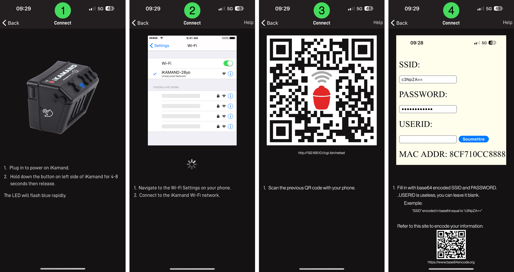

# iKamand Binding

This binding integrates the **Kamado Joe iKamand** BBQ controller with openHAB.
The iKamand is an IoT accessory that regulates a charcoal grill by driving a variable-speed fan and by reporting pit and food probe temperatures.
With this binding openHAB can monitor these values and control basic cooking functions such as starting and stopping the grill or individual cook sessions.

### Main Features

* Read the current pit temperature, three food probe temperatures, and the current fan speed.
* Start a grill session at a target pit temperature and stop it again.
* Start and stop up to three independent cook sessions based on the food probes.
* Observe the reported cook and grill end times from the controller.

### Tested Hardware / Firmware

The binding has been tested with an **iKamand v2** running firmware **4.4.0**.
Earlier or later firmware revisions are expected to work as the HTTP API used by the binding has not changed in recent years.

### How to connect the iKamand module to your Wi-Fi router

The iKamand must be connected to your home network before it can be added to openHAB.
Follow these steps if you iKamand is not already connected:

1. Plug in to power on iKamand.
2. Hold down the button on left side of iKamand for 4-8 seconds then release. The LED will flash blue rapidly.
3. Navigate to the Wi-Fi Settings on your phone.
4. Connect to the iKamand Wi-Fi network.
5. Scan the previous QR code with your phone or visit `http://192.168.10.1/cgi-bin/netset`
6. Fill in with base64 encoded SSID and PASSWORD. USERID is useless, you can leave it blank.

<span align="center">



</span>

## Supported Things

The binding provides a single thing type.

| Thing Type UID | Description |
|----------------|-------------|
| `ikamand` | Represents one physical iKamand controller. |

## Discovery

The iKamand does **not** advertise itself on the local network.
You therefore have to create the thing manually and enter the controller's IP address or hostname.

## Binding Configuration

There is no global configuration required.
All options are defined per thing.

## Thing Configuration

| Parameter | Type | Required | Default | Description |
|-----------|------|----------|---------|-------------|
| `hostname` | text | yes | | Hostname or IP address of the iKamand. |
| `refreshInterval` | integer (s) | no | `10` | Polling period used by the binding. |
| `defaultGrillTemperature` | integer (°C) | no | `190` | Temperature used when the `grill-start` channel is triggered without a value. |

### Example Thing Definition

```
Thing ikamand:ikamand:bbq "Kamado Joe iKamand" [ hostname="192.168.1.42", refreshInterval=15, defaultGrillTemperature=190 ]
```

## Channels

| Channel ID | Item Type | R/W | Description |
|------------|-----------|-----|-------------|
| `fan-speed` | Number | R | Current fan speed as a percentage (0–100 %). |
| `temperature-pit-current` | Number:Temperature | R | Measured pit temperature. |
| `temperature-pit-target` | Number:Temperature | R | Target pit temperature currently set on the controller. |
| `temperature-probe1-current` | Number:Temperature | R | Current temperature of food probe 1. |
| `temperature-probe2-current` | Number:Temperature | R | Current temperature of food probe 2. |
| `temperature-probe3-current` | Number:Temperature | R | Current temperature of food probe 3. |
| `temperature-probe1-target` | Number:Temperature | R | Target temperature for food probe 1. |
| `temperature-probe2-target` | Number:Temperature | R | Target temperature for food probe 2. |
| `temperature-probe3-target` | Number:Temperature | R | Target temperature for food probe 3. |
| `cook-start-probe-1` | Number:Temperature | W | Start a cook session for probe 1 at the given food target temperature (66–260 °C). |
| `cook-start-probe-2` | Number:Temperature | W | Start a cook session for probe 2. |
| `cook-start-probe-3` | Number:Temperature | W | Start a cook session for probe 3. |
| `cook-stop` | Number | W | Stop the cook session for the selected probe (`0` = none / `1` = probe 1 / `2` = probe 2 / `3` = probe 3). |
| `grill-start` | Number:Temperature | W | Start a grill session at the given target pit temperature (66–260 °C). |
| `grill-running` | Switch | RW | *ON* when the grill session is active; switch to *OFF* to stop the grill. |
| `rm` | String | R | Raw *RM* status field (undocumented). |
| `cm` | String | R | Raw *CM* status field (undocumented). |
| `as` | String | R | Raw *AS* status field (undocumented). |
| `current-time` | DateTime | R | Epoch time reported by the device. |
| `cook-end-time` | DateTime | R | Estimated end time of the current cook session. |
| `grill-end-time` | DateTime | R | Estimated end time of the current grill session. |

## Full Example

### Thing File (`ikamand.things`)

```
Thing ikamand:ikamand:bbq "Kamado Joe iKamand" [ hostname="192.168.1.42" ]
```

### Item File (`ikamand.items`)

```
Number   Pit_Temperature        "Pit Temperature [%.1f °C]"        { channel="ikamand:ikamand:bbq:temperature-pit-current" }
Number   Probe1_Temperature     "Probe 1 Temperature [%.1f °C]"    { channel="ikamand:ikamand:bbq:temperature-probe1-current" }
Number   Probe2_Temperature     "Probe 2 Temperature [%.1f °C]"    { channel="ikamand:ikamand:bbq:temperature-probe2-current" }
Number   Probe3_Temperature     "Probe 3 Temperature [%.1f °C]"    { channel="ikamand:ikamand:bbq:temperature-probe3-current" }
Number   Fan_Speed              "Fan Speed [%d %%]"                 { channel="ikamand:ikamand:bbq:fan-speed" }
Switch   Grill_Running          "Grill Running"                     { channel="ikamand:ikamand:bbq:grill-running" }
Number   Start_Grill            "Start Grill [%.0f °C]"             { channel="ikamand:ikamand:bbq:grill-start" }
Number   Start_Probe1_Cook      "Start Probe 1 Cook [%.0f °C]"      { channel="ikamand:ikamand:bbq:cook-start-probe-1" }
Number   Stop_Cook              "Stop Cook"                         { channel="ikamand:ikamand:bbq:cook-stop" }
```

### Sitemap (`ikamand.sitemap`)

```
sitemap bbq label="Kamado Joe"
{
    Frame label="Pit"
    {
        Text item=Pit_Temperature
        Text item=Probe1_Temperature
        Text item=Fan_Speed
        Switch item=Grill_Running
        Setpoint item=Start_Grill         minValue=66 maxValue=260 step=5
        Setpoint item=Start_Probe1_Cook   minValue=66 maxValue=260 step=5
        Selection item=Stop_Cook mappings=[0="None",1="Probe 1",2="Probe 2",3="Probe 3"]
    }
}
```

## Notes

* Temperatures are handled internally in Celsius.
  Fahrenheit values sent from a user interface are converted by the binding.
* The undocumented channels `rm`, `cm`, and `as` expose raw status strings that may be useful for advanced troubleshooting.
* The controller does not offer an official API.
  All information in this binding is based on reverse-engineering of the HTTP requests generated by the mobile application.

---

© Contributors to the openHAB project, 2025.
