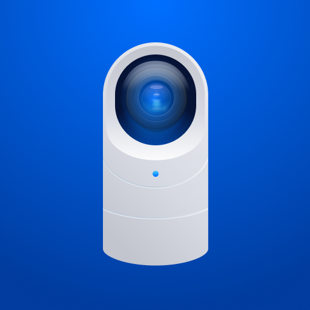
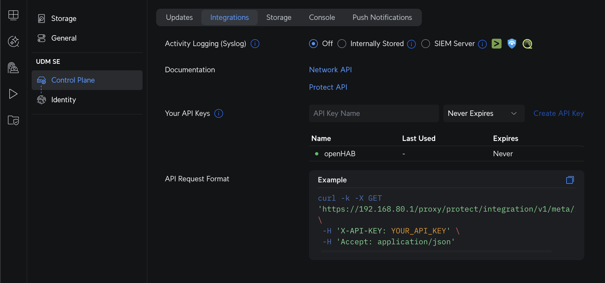

# UniFi Protect Binding



This binding integrates Ubiquiti UniFi Protect into openHAB.
It connects to your Protect NVR/CloudKey/UNVR and provides live events and configurable settings for Cameras, Floodlights, and Sensors.

It uses the official Protect Integration API over HTTPS and WebSocket with a Bearer Token.

## Supported Things

- `unifiprotect:nvr` (Bridge): The Protect NVR/CloudKey/UNVR.
  Required to discover and manage child devices.
- `unifiprotect:camera`: A Protect camera.
  Channels are added dynamically based on device capabilities (mic, HDR, smart detection, PTZ, etc.).
- `unifiprotect:light`: A Protect Floodlight.
- `unifiprotect:sensor`: A Protect environmental/contact sensor.

## Discovery

- Add the `NVR` bridge by entering its Hostname/IP and an Integration API Token.
- Once the NVR is ONLINE, Cameras, Floodlights, and Sensors are discovered automatically and appear in the Inbox.
- Approve discovered things to add them to your system.
  Manual creation is also possible using `deviceId`.

## Binding Configuration

There are no global binding settings.
All configuration is on the NVR bridge and on individual things.

## Thing Configuration

### NVR (Bridge) `unifiprotect:nvr`

| Name | Type | Description | Default | Required | Advanced |
|------|------|-------------|---------|----------|----------|
| hostname | text | Hostname or IP address of the NVR | N/A | yes | no |
| token | text | Bearer token used for API/WebSocket authentication | N/A | yes | no |

How to get the Token:

- In the UniFi Protect UI, go to Settings → Control Plane → Integrations and create an API token.
- Copy the token and paste it into the NVR bridge configuration in openHAB.




### Camera `unifiprotect:camera`

| Name | Type | Description | Required |
|------|------|-------------|----------|
| deviceId | text | Unique device identifier of the camera | yes |

Cameras are best added via discovery.
For manual setup, the `deviceId` can be taken from the discovery inbox, logs, or Protect API.

### Floodlight `unifiprotect:light`

| Name | Type | Description | Required |
|------|------|-------------|----------|
| deviceId | text | Unique device identifier of the floodlight | yes |

### Sensor `unifiprotect:sensor`

| Name | Type | Description | Required |
|------|------|-------------|----------|
| deviceId | text | Unique device identifier of the sensor | yes |

## Channels

Below are the channels exposed by each thing type.
Some camera channels are created dynamically depending on device capabilities.

### NVR (Bridge)

No channels.

### Camera

- The following are dynamically created depending on features.

| Channel ID | Item Type | RW | Description |
|------------|-----------|----|-------------|
| mic-volume | Number | RW | Microphone volume (0-100) |
| video-mode | String | RW | Camera video mode (e.g., `default`, `highFps`, `sport`, `slowShutter`, `lprReflex`, `lprNoneReflex`) |
| hdr-type | String | RW | HDR mode (`auto`, `on`, `off`) |
| osd-name | Switch | RW | Show name on OSD |
| osd-date | Switch | RW | Show date on OSD |
| osd-logo | Switch | RW | Show logo on OSD |
| led-enabled | Switch | RW | Enable/disable camera status LED |
| active-patrol-slot | Number | RW | Active PTZ patrol slot (set 0 to stop) |
| motion-contact | Contact | R | Motion state (OPEN = motion detected) |
| motion-snapshot | Image | R | Snapshot captured around motion event |
| smart-audio-detect-contact | Contact | R | Smart audio detection active state |
| smart-audio-detect-snapshot | Image | R | Snapshot captured around smart audio detection |
| smart-detect-zone-contact | Contact | R | Smart zone detection active state |
| smart-detect-zone-snapshot | Image | R | Snapshot captured around smart zone detection |
| smart-detect-line-contact | Contact | R | Smart line detection active state |
| smart-detect-line-snapshot | Image | R | Snapshot captured around smart line detection |
| smart-detect-loiter-contact | Contact | R | Smart loiter detection active state |
| smart-detect-loiter-snapshot | Image | R | Snapshot captured around smart loiter detection |

Trigger channels (for rules):

| Trigger Channel ID | Payload (if any) | Description |
|--------------------|------------------|-------------|
| motion-start | none | Motion started |
| motion-update | none | Motion updated (debounced update event) |
| smart-audio-detect-start | `alrmSmoke`, `alrmCmonx`, `alrmSiren`, `alrmBabyCry`, `alrmSpeak`, `alrmBark`, `alrmBurglar`, `alrmCarHorn`, `alrmGlassBreak`, `none` | Smart audio detection started |
| smart-audio-detect-update | `alrmSmoke`, `alrmCmonx`, `alrmSiren`, `alrmBabyCry`, `alrmSpeak`, `alrmBark`, `alrmBurglar`, `alrmCarHorn`, `alrmGlassBreak`, `none` | Smart audio detection updated |
| smart-detect-zone-start | `person`, `vehicle`, `package`, `licensePlate`, `face`, `animal`, `none` | Zone smart detection started |
| smart-detect-zone-update | `person`, `vehicle`, `package`, `licensePlate`, `face`, `animal`, `none` | Zone smart detection updated |
| smart-detect-line-start | `person`, `vehicle`, `package`, `licensePlate`, `face`, `animal`, `none` | Line smart detection started |
| smart-detect-line-update | `person`, `vehicle`, `package`, `licensePlate`, `face`, `animal`, `none` | Line smart detection updated |
| smart-detect-loiter-start | `person`, `vehicle`, `package`, `licensePlate`, `face`, `animal`, `none` | Loiter smart detection started |
| smart-detect-loiter-update | `person`, `vehicle`, `package`, `licensePlate`, `face`, `animal`, `none` | Loiter smart detection updated |

### Floodlight

| Channel ID | Item Type | RW | Description |
|------------|-----------|----|-------------|
| light | Switch | RW | Main floodlight on/off (forces light) |
| is-dark | Switch | R | Scene is currently dark |
| pir-motion | Trigger | - | PIR motion event |
| last-motion | DateTime | R | Timestamp of last motion |
| light-mode | String | RW | Light mode (`always`, `motion`, `off`) |
| enable-at | String | RW | When mode is relevant (`fulltime`, `dark`) |
| indicator-enabled | Switch | RW | Status LED indicator on floodlight |
| pir-duration | Number | RW | How long the light stays on after motion (milliseconds) |
| pir-sensitivity | Number | RW | PIR motion sensitivity (0-100) |
| led-level | Number | RW | LED brightness level (1-6) |

### Sensor

| Channel ID | Item Type | RW | Description |
|------------|-----------|----|-------------|
| battery | Number | R | Battery charge level (%) |
| contact | Contact | R | Contact state (OPEN/CLOSED) |
| temperature | Number:Temperature | R | Ambient temperature |
| humidity | Number | R | Ambient humidity |
| illuminance | Number:Illuminance | R | Ambient light (Lux) |
| alarm-contact | Contact | R | Smoke/CO alarm contact (OPEN = alarming) |
| water-leak-contact | Contact | R | Water leak contact (OPEN = leak) |
| tamper-contact | Contact | R | Tamper contact (OPEN = tampering) |

Trigger channels (for rules):

| Trigger Channel ID | Payload (if any) | Description |
|--------------------|------------------|-------------|
| opened | `door`, `window`, `garage`, `leak`, `none` | Sensor opened |
| closed | `door`, `window`, `garage`, `leak`, `none` | Sensor closed |
| alarm | `smoke`, `CO` (optional) | Smoke/CO alarm event |
| water-leak | `door`, `window`, `garage`, `leak`, `none` | Water leak detected |
| tamper | none | Tampering detected |

## Full Examples (Textual Configuration)

Replace the IDs with your own thing and item names.

### Things (`.things`)

```
Bridge unifiprotect:nvr:myNvr "UniFi Protect NVR" [ hostname="192.168.1.10", token="YOUR_LONG_TOKEN" ] {
	Thing unifiprotect:camera:frontdoor [ deviceId="60546f80e4b0abcd12345678" ]
	Thing unifiprotect:light:driveway [ deviceId="60a1b2c3d4e5f67890123456" ]
	Thing unifiprotect:sensor:garagedoor [ deviceId="60112233445566778899aabb" ]
}
```

### Items (`.items`)

```
// Camera
Number  Cam_Front_MicVolume        "Mic Volume [%d]"                   { channel="unifiprotect:camera:myNvr:frontdoor:mic-volume" }
String  Cam_Front_VideoMode        "Video Mode [%s]"                    { channel="unifiprotect:camera:myNvr:frontdoor:video-mode" }
String  Cam_Front_HDR              "HDR [%s]"                           { channel="unifiprotect:camera:myNvr:frontdoor:hdr-type" }
Switch  Cam_Front_OSD_Name         "OSD Name"                           { channel="unifiprotect:camera:myNvr:frontdoor:osd-name" }
Switch  Cam_Front_OSD_Date         "OSD Date"                           { channel="unifiprotect:camera:myNvr:frontdoor:osd-date" }
Switch  Cam_Front_OSD_Logo         "OSD Logo"                           { channel="unifiprotect:camera:myNvr:frontdoor:osd-logo" }
Switch  Cam_Front_LED              "Status LED"                         { channel="unifiprotect:camera:myNvr:frontdoor:led-enabled" }
Number  Cam_Front_PatrolSlot       "PTZ Patrol Slot [%d]"               { channel="unifiprotect:camera:myNvr:frontdoor:active-patrol-slot" }
Contact Cam_Front_Motion           "Motion [%s]"                        { channel="unifiprotect:camera:myNvr:frontdoor:motion-contact" }
Image   Cam_Front_MotionSnapshot   "Motion Snapshot"                    { channel="unifiprotect:camera:myNvr:frontdoor:motion-snapshot" }

// Floodlight
Switch  Light_Driveway_OnOff       "Driveway Light"                     { channel="unifiprotect:light:myNvr:driveway:light" }
Switch  Light_Driveway_IsDark      "Is Dark"                            { channel="unifiprotect:light:myNvr:driveway:is-dark" }
DateTime Light_Driveway_LastMotion "Last Motion [%1$ta %1$tR]"          { channel="unifiprotect:light:myNvr:driveway:last-motion" }
String  Light_Driveway_Mode        "Mode [%s]"                          { channel="unifiprotect:light:myNvr:driveway:light-mode" }
String  Light_Driveway_EnableAt    "Enable At [%s]"                     { channel="unifiprotect:light:myNvr:driveway:enable-at" }
Switch  Light_Driveway_Indicator   "Indicator LED"                      { channel="unifiprotect:light:myNvr:driveway:indicator-enabled" }
Number  Light_Driveway_PIR_Dur     "PIR Duration [%.0f ms]"             { channel="unifiprotect:light:myNvr:driveway:pir-duration" }
Number  Light_Driveway_PIR_Sens    "PIR Sensitivity [%.0f]"             { channel="unifiprotect:light:myNvr:driveway:pir-sensitivity" }
Number  Light_Driveway_LED_Level   "LED Level [%.0f]"                   { channel="unifiprotect:light:myNvr:driveway:led-level" }

// Sensor
Number  Sensor_Garage_Battery      "Battery [%.0f %%]"                  { channel="unifiprotect:sensor:myNvr:garagedoor:battery" }
Contact Sensor_Garage_Contact      "Contact [%s]"                       { channel="unifiprotect:sensor:myNvr:garagedoor:contact" }
Number:Temperature Sensor_Garage_T "Temperature [%.1f %unit%]"         { channel="unifiprotect:sensor:myNvr:garagedoor:temperature" }
Number  Sensor_Garage_Humidity     "Humidity [%.0f %%]"                 { channel="unifiprotect:sensor:myNvr:garagedoor:humidity" }
Number:Illuminance Sensor_Garage_L "Illuminance [%.0f lx]"              { channel="unifiprotect:sensor:myNvr:garagedoor:illuminance" }
Contact Sensor_Garage_Alarm        "Alarm [%s]"                         { channel="unifiprotect:sensor:myNvr:garagedoor:alarm-contact" }
Contact Sensor_Garage_Leak         "Leak [%s]"                          { channel="unifiprotect:sensor:myNvr:garagedoor:water-leak-contact" }
Contact Sensor_Garage_Tamper       "Tamper [%s]"                        { channel="unifiprotect:sensor:myNvr:garagedoor:tamper-contact" }
```

### Sitemap (`.sitemap`)

``` 
sitemap home label="Home" {
	Frame label="Front Door Camera" {
		Text item=Cam_Front_Motion
		Image item=Cam_Front_MotionSnapshot
	}
	Frame label="Driveway Floodlight" {
		Switch item=Light_Driveway_OnOff
		Text item=Light_Driveway_IsDark
		Text item=Light_Driveway_LastMotion
		Selection item=Light_Driveway_Mode mappings=[always="Always", motion="Motion", off="Off"]
		Selection item=Light_Driveway_EnableAt mappings=[fulltime="Full time", dark="Dark"]
		Setpoint item=Light_Driveway_PIR_Sens minValue=0 maxValue=100 step=1
		Setpoint item=Light_Driveway_LED_Level minValue=1 maxValue=6 step=1
	}
	Frame label="Garage Sensor" {
		Text item=Sensor_Garage_Contact
		Text item=Sensor_Garage_T
		Text item=Sensor_Garage_Humidity
		Text item=Sensor_Garage_L
		Text item=Sensor_Garage_Battery
	}
}
```

### Rules (`.rules`)

Examples showing trigger channels.

``` 
// Camera motion start/update
rule "Front door motion alert"
when
	Channel "unifiprotect:camera:myNvr:frontdoor:motion-start" triggered
then
	logInfo("protect", "Front door motion started")
end

rule "Front door motion update"
when
	Channel "unifiprotect:camera:myNvr:frontdoor:motion-update" triggered
then
	logInfo("protect", "Front door motion update")
end

// Camera smart detection with payload
rule "Front door smart zone detect"
when
	Channel "unifiprotect:camera:myNvr:frontdoor:smart-detect-zone-start" triggered
then
	// Access payload from the trigger channel event (person, vehicle, package, licensePlate, face, animal, none)
	val String payload = receivedEvent.getEvent()
	logInfo("protect", "Smart zone detection started: {}", payload)
end

rule "Front door smart zone update"
when
	Channel "unifiprotect:camera:myNvr:frontdoor:smart-detect-zone-update" triggered
then
	val String payload = receivedEvent.getEvent()
	logInfo("protect", "Smart zone detection updated: {}", payload)
end

// Camera smart audio detect with payload
rule "Front door smart audio detect"
when
	Channel "unifiprotect:camera:myNvr:frontdoor:smart-audio-detect-start" triggered
then
	val String payload = receivedEvent.getEvent() // alrmSmoke, alrmCmonx, alrmSiren, alrmBabyCry, alrmSpeak, alrmBark, alrmBurglar, alrmCarHorn, alrmGlassBreak, none
	logInfo("protect", "Smart audio detected: {}", payload)
end

rule "Front door smart audio update"
when
	Channel "unifiprotect:camera:myNvr:frontdoor:smart-audio-detect-update" triggered
then
	val String payload = receivedEvent.getEvent()
	logInfo("protect", "Smart audio detection updated: {}", payload)
end

// Camera doorbell ring with payload filtering
rule "Front doorbell pressed"
when
	Channel "unifiprotect:camera:myNvr:frontdoor:ring" triggered PRESSED
then
	logInfo("protect", "Doorbell pressed")
end

// Or handle any ring payload generically
rule "Front doorbell ring generic"
when
	Channel "unifiprotect:camera:myNvr:frontdoor:ring" triggered
then
	val String payload = receivedEvent.getEvent() // PRESSED, RELEASED
	logInfo("protect", "Doorbell ring event: {}", payload)
end

// Floodlight PIR motion trigger
rule "Driveway PIR motion"
when
	Channel "unifiprotect:light:myNvr:driveway:pir-motion" triggered
then
	logInfo("protect", "Driveway PIR motion")
	// Optionally turn on the light for a bit
	sendCommand(Light_Driveway_OnOff, ON)
	createTimer(now.plusSeconds(30), [ | sendCommand(Light_Driveway_OnOff, OFF) ])
end

// Sensor opened/closed with payload
rule "Garage sensor opened"
when
	Channel "unifiprotect:sensor:myNvr:garagedoor:opened" triggered
then
	val String payload = receivedEvent.getEvent() // door, window, garage, leak, none
	logInfo("protect", "Garage sensor opened: {}", payload)
end

rule "Garage sensor closed"
when
	Channel "unifiprotect:sensor:myNvr:garagedoor:closed" triggered
then
	val String payload = receivedEvent.getEvent() // door, window, garage, leak, none
	logInfo("protect", "Garage sensor closed: {}", payload)
end

// Sensor water leak
rule "Garage water leak"
when
	Channel "unifiprotect:sensor:myNvr:garagedoor:water-leak" triggered
then
	val String payload = receivedEvent.getEvent() // door, window, garage, leak, none
	logWarn("protect", "Water leak detected by garage sensor: {}", payload)
end
```
