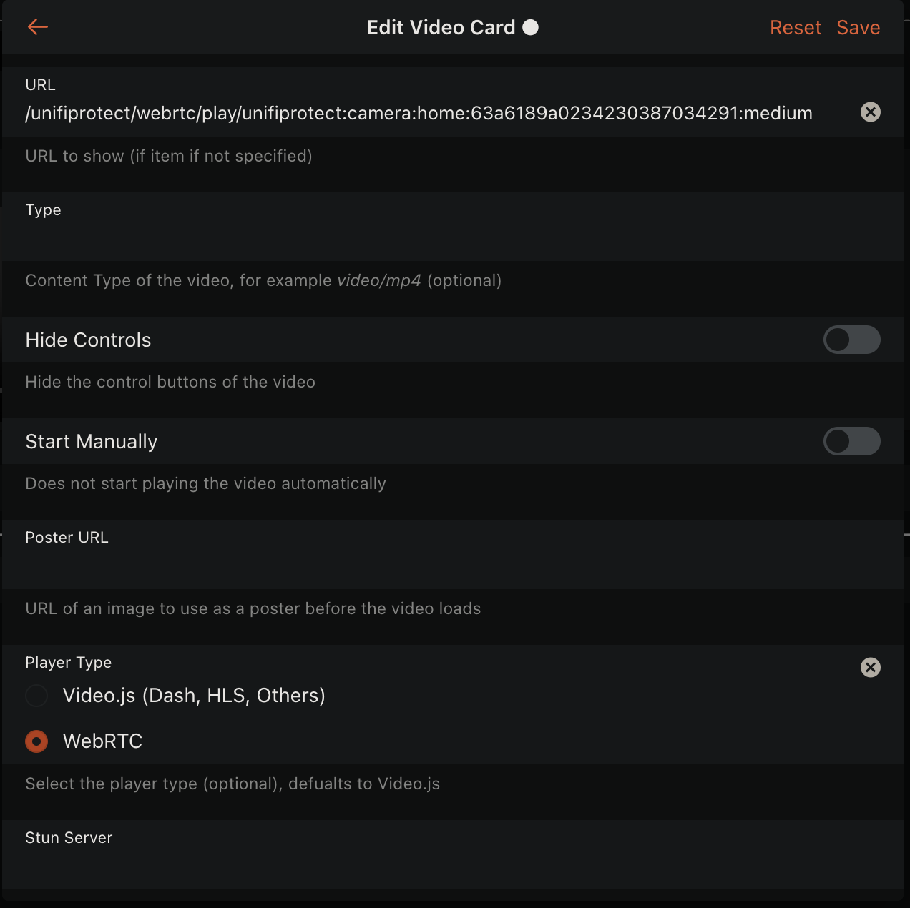

# UniFi Protect Binding

This binding integrates Ubiquiti UniFi Protect into openHAB.
It connects to your Protect NVR/CloudKey/UNVR and provides live events and configurable settings for Cameras, Floodlights, Sensors, Doorlocks, and Chimes.

It uses both the official Protect Integration API (Public API) and the Private API for comprehensive device control and monitoring.
The binding automatically manages API authentication, including auto-creation of API keys when needed.

## Features

- Supports multiple Protect devices (Cameras, Doorbells, Floodlights, Sensors)
- Has granular triggers and channels for realtime motion events including AI object detection, audio, and line crossing events.
- Uses websockets for realtime updates without polling
- Supports [WebRTC streaming](#real-time-media) for cameras with very low server CPU overhead
- Supports [2-way audio](#talkback-support-2-way-audio) for cameras that support it
- Uses STUN for external access to cameras when outside your local network (e.g. when using the openHAB cloud service)
- Provides general purpose image snapshot API endpoints for cameras

## Native Binaries

- Uses [go2rtc](https://github.com/AlexxIT/go2rtc) and [FFmpeg](https://ffmpeg.org/) for WebRTC playback and publishing.
- The binding will automatically download and extract the binaries if they are not present on linux, mac, windows and freeBSD.
- By default the binding will first try and find the binaries on the system PATH before downloading them.
- If your platform is not supported, or downloading the binaries is not possible, install the binaries manually and ensure they are on the system PATH.

See [Binding Configuration](#binding-configuration) to enable/disable downloading the binaries.

## Supported Things

- `nvr` (Bridge): The Protect NVR/CloudKey/UNVR.
  Required to discover and manage child devices. Provides NVR monitoring channels.
- `camera`: A Protect camera.
  Channels are added dynamically based on device capabilities (mic, HDR, smart detection, PTZ, etc.).
- `light`: A Protect Floodlight.
- `sensor`: A Protect environmental/contact sensor.
- `doorlock`: A Protect Smart Doorlock.
- `chime`: A Protect Chime device.

## Discovery

- Add the `nvr` bridge by entering its Hostname/IP, username, and password.
- The binding will automatically create an API key for the Public API if not provided.
- Once the NVR is ONLINE, Cameras, Floodlights, Sensors, Doorlocks, and Chimes are discovered automatically and appear in the Inbox.
- Approve discovered things to add them to your system.
  Manual creation is also possible using `deviceId`.

## Binding Configuration

| Name             | Type    | Description                                                                                                                                                                                                                                                                         | Required |
|------------------|---------|-------------------------------------------------------------------------------------------------------------------------------------------------------------------------------------------------------------------------------------------------------------------------------------|----------|
| downloadBinaries | boolean | Download binaries if they are not on the system PATH. This setting controls whether the binding should download the native binaries if they are not found. By default, the binding will download the binaries if they are not on the system PATH for supported platforms | yes      |
| useStun          | boolean | Use STUN for external IP discovery. This will allow camera streams to work behind NATs when outside your local network (e.g. when using the openHAB cloud service) and is enabled by default.                                                                                      | yes      |

Note: Enabling STUN will incur an approximately 5-second delay delivering the stream to clients as it discovers your external IP and pins a port on your router for streams. If you are not using the openHAB cloud service with cameras, disabling STUN will allow for near-instant stream starts (video will start within a second of loading) on your local network or over a VPN.

## Thing Configuration

### NVR (Bridge) `nvr`

| Name     | Type | Description                                        | Default | Required | Advanced |
|----------|------|----------------------------------------------------|---------|----------|----------|
| hostname | text | Hostname or IP address of the NVR                  | N/A     | yes      | no       |
| port     | number | Port number for the NVR                          | 443     | no       | yes      |
| username | text | Local username for authentication                  | N/A     | yes      | no       |
| password | text | Password for the local user                        | N/A     | yes      | no       |
| token    | text | Bearer token used for Public API authentication    | N/A     | no       | yes      |

**Authentication:**

The binding requires a local UniFi Protect username and password to access both the Private and Public APIs.

- **API Key (Token)**: If not provided, the binding will automatically create an API key named `openHAB-<thing-id>` for the Public API.
  The key is stored in your thing configuration and reused on restarts.
  
- **Private API**: Uses cookie-based authentication with the provided username/password.
  Session cookies are persisted and automatically refreshed when needed.

**Manual API Key Creation** (optional):

If you prefer to manually create an API key:

1. In the UniFi Protect UI, go to Settings → Control Plane → Integrations and create an API token.
2. Copy the token and paste it into the `token` field in the NVR bridge configuration.


### `camera` Configuration

| Name         | Type    | Description                            | Required |
|--------------|---------|----------------------------------------|----------|
| deviceId     | text    | Unique device identifier of the camera | yes      |
| enableWebRTC | boolean | Enable WebRTC streaming                | yes      |

When WebRTC is enabled, the camera will be able to stream through openHAB using WebRTC.
You can disable WebRTC by setting `enableWebRTC` to `false`.

### `light` Configuration

| Name     | Type | Description                                | Required |
|----------|------|--------------------------------------------|----------|
| deviceId | text | Unique device identifier of the floodlight | yes      |

### `sensor` Configuration

| Name     | Type | Description                            | Required |
|----------|------|----------------------------------------|----------|
| deviceId | text | Unique device identifier of the sensor | yes      |

### `doorlock` Configuration

| Name     | Type | Description                              | Required |
|----------|------|------------------------------------------|----------|
| deviceId | text | Unique device identifier of the doorlock | yes      |

### `chime` Configuration

| Name     | Type | Description                          | Required |
|----------|------|--------------------------------------|----------|
| deviceId | text | Unique device identifier of the chime | yes      |

## Channels

Below are the channels exposed by each thing type.
Some camera channels are created dynamically depending on device capabilities.

### `nvr` Bridge Channels

The NVR bridge provides comprehensive monitoring channels for system health, storage, and configuration.

| Channel ID                       | Item Type          | RW | API    | Description                                      | Advanced |
|----------------------------------|--------------------|----|--------|--------------------------------------------------|----------|
| storage-total                    | Number:DataAmount  | R  | Private| Total storage capacity                           | false    |
| storage-used                     | Number:DataAmount  | R  | Private| Used storage                                     | false    |
| storage-available                | Number:DataAmount  | R  | Private| Available storage                                | false    |
| storage-utilization              | Number:Dimensionless| R | Private| Storage utilization percentage                   | false    |
| recording-retention              | Number:Time        | R  | Private| Recording retention duration                     | false    |
| nvr-storage-device-healthy       | Switch             | R  | Private| All storage devices healthy                      | false    |
| nvr-camera-utilization           | Number             | R  | Private| Camera capacity utilization percentage           | false    |
| nvr-recording-mode               | String             | R  | Private| Global camera recording mode                     | false    |
| nvr-recording-disabled           | Switch             | R  | Private| Recording globally disabled                      | false    |
| nvr-recording-motion-only        | Switch             | R  | Private| Recording motion only                            | false    |
| nvr-is-away                      | Switch             | R  | Private| NVR away mode status                             | false    |
| nvr-geofencing-enabled           | Switch             | R  | Private| Geofencing enabled                               | false    |
| nvr-smart-detection-available    | Switch             | R  | Private| Smart detection available                        | false    |
| nvr-insights-enabled             | Switch             | R  | Private| Insights enabled                                 | false    |
| nvr-can-auto-update              | Switch             | R  | Private| Can auto-update                                  | false    |
| nvr-last-update-at               | DateTime           | R  | Private| Last update timestamp                            | false    |
| nvr-protect-updatable            | Switch             | R  | Private| Protect is updatable                             | false    |

### `camera` Channels

- The following are dynamically created depending on the supported features.
- Advanced channels are hidden by default in the MainUI, select "Show Advanced" to see them.
- **API Column**: Indicates whether the channel uses the Public or Private API.

#### Basic Control & Settings

| Channel ID                             | Item Type   | RW | API    | Description                                                                                          | Advanced |
|----------------------------------------|-------------|----|--------|------------------------------------------------------------------------------------------------------|----------|
| mic-volume                             | Dimmer      | RW | Public | Microphone volume (0-100)                                                                            | false    |
| video-mode                             | String      | RW | Public | Camera video mode (e.g., `default`, `highFps`, `sport`, `slowShutter`, `lprReflex`, `lprNoneReflex`) | false    |
| hdr-type                               | String      | RW | Public | HDR mode (`auto`, `on`, `off`)                                                                       | false    |
| osd-name                               | Switch      | RW | Public | Show name on OSD                                                                                     | false    |
| osd-date                               | Switch      | RW | Public | Show date on OSD                                                                                     | false    |
| osd-logo                               | Switch      | RW | Public | Show logo on OSD                                                                                     | false    |
| led-enabled                            | Switch      | RW | Public | Enable/disable camera status LED                                                                     | false    |
| active-patrol-slot                     | Number      | RW | Public | Active PTZ patrol slot (set 0 to stop)                                                               | false    |
| privacy-mode                           | Switch      | RW | Both   | Privacy mode (disables recording/streaming)                                                          | false    |

#### Streaming URLs

| Channel ID                             | Item Type   | RW | API     | Description                                                                                          | Advanced |
|----------------------------------------|-------------|----|---------|------------------------------------------------------------------------------------------------------|----------|
| webrtc-url-high                        | String      | R  | Public  | WebRTC stream URL for high quality                                                                   | true     |
| webrtc-url-medium                      | String      | R  | Public  | WebRTC stream URL for medium quality                                                                 | true     |
| webrtc-url-low                         | String      | R  | Public  | WebRTC stream URL for low quality                                                                    | true     |
| webrtc-url-package                     | String      | R  | Public  | WebRTC stream URL for package quality                                                                | true     |
| rtsp-url-high                          | String      | R  | Private | RTSP stream URL for high quality                                                                     | true     |
| rtsp-url-medium                        | String      | R  | Private | RTSP stream URL for medium quality                                                                   | true     |
| rtsp-url-low                           | String      | R  | Private | RTSP stream URL for low quality                                                                      | true     |
| rtsp-url-package                       | String      | R  | Private | RTSP stream URL for package quality                                                                  | true     |

#### Snapshots & Images

| Channel ID                             | Item Type   | RW | API    | Description                                                                                          | Advanced |
|----------------------------------------|-------------|----|--------|------------------------------------------------------------------------------------------------------|----------|
| snapshot                               | Image       | R  | Public | Snapshot image. Send a `REFRESH` command to update.                                                  | false    |
| snapshot-url                           | String      | R  | Public | Snapshot image URL                                                                                   | true     |
| motion-snapshot                        | Image       | R  | Public | Snapshot captured around motion event                                                                | false    |
| smart-detect-audio-snapshot            | Image       | R  | Public | Snapshot captured around smart audio detection                                                       | false    |
| smart-detect-zone-snapshot             | Image       | R  | Public | Snapshot captured around smart zone detection                                                        | false    |
| smart-detect-line-snapshot             | Image       | R  | Public | Snapshot captured around smart line detection                                                        | false    |
| smart-detect-loiter-snapshot           | Image       | R  | Public | Snapshot captured around smart loiter detection                                                      | false    |
| motion-thumbnail                       | Image       | R  | Private| Motion event thumbnail image                                                                         | false    |
| motion-heatmap                         | Image       | R  | Private| Motion event heatmap image                                                                           | true     |

#### Motion & Detection

| Channel ID                             | Item Type   | RW | API    | Description                                                                                          | Advanced |
|----------------------------------------|-------------|----|--------|------------------------------------------------------------------------------------------------------|----------|
| motion-contact                         | Contact     | R  | Public | Motion state (OPEN = motion detected)                                                                | false    |
| smart-detect-audio-contact             | Contact     | R  | Public | Smart audio detection active state                                                                   | false    |
| smart-detect-zone-contact              | Contact     | R  | Public | Smart zone detection active state                                                                    | false    |
| smart-detect-line-contact              | Contact     | R  | Public | Smart line detection active state                                                                    | false    |
| smart-detect-loiter-contact            | Contact     | R  | Public | Smart loiter detection active state                                                                  | false    |
| is-motion-detected                     | Switch      | R  | Private| Motion currently detected                                                                            | false    |
| last-motion                            | DateTime    | R  | Private| Timestamp of last motion                                                                             | false    |
| last-smart-detect                      | DateTime    | R  | Private| Timestamp of last smart detection                                                                    | false    |
| last-smart-detect-types                | String      | R  | Private| Types of last smart detection (comma-separated)                                                      | false    |

#### Doorbell

| Channel ID                             | Item Type   | RW | API    | Description                                                                                          | Advanced |
|----------------------------------------|-------------|----|--------|------------------------------------------------------------------------------------------------------|----------|
| doorbell-default-message               | String      | RW | Public | Default doorbell LCD message text configured on the NVR                                              | false    |
| doorbell-default-message-reset-timeout | Number:Time | RW | Public | Default doorbell LCD message reset timeout                                                           | false    |
| doorbell-ringing                       | Contact     | R  | Private| Doorbell currently ringing                                                                           | false    |
| last-ring                              | DateTime    | R  | Private| Timestamp of last doorbell ring                                                                      | false    |

#### Device Status & Health

| Channel ID                             | Item Type          | RW | API     | Description                                                                                          | Advanced |
|----------------------------------------|--------------------|----|---------|------------------------------------------------------------------------------------------------------|----------|
| is-connected                           | Switch             | R  | Private | Camera is connected                                                                                  | false    |
| is-dark                                | Switch             | R  | Private | Scene is currently dark                                                                              | false    |
| connection-host                        | String             | R  | Private | Connection host address                                                                              | true     |
| uptime                                 | Number:Time        | R  | Private | Device uptime                                                                                        | false    |
| uptime-since                           | DateTime           | R  | Private | Device up since timestamp                                                                            | true     |
| last-seen                              | DateTime           | R  | Private | Last seen timestamp                                                                                  | false    |
| last-disconnect                        | DateTime           | R  | Private | Last disconnect timestamp                                                                            | true     |
| connection-state                       | String             | R  | Private | Connection state                                                                                     | true     |
| state                                  | String             | R  | Private | Device state                                                                                         | true     |
| wired-connection-state                 | String             | R  | Private | Wired connection state                                                                               | true     |
| physical-connection-rate               | Number:DataTransferRate | R | Private | Physical connection rate                                                                          | true     |

#### Network & WiFi

| Channel ID                             | Item Type          | RW | API     | Description                                                                                          | Advanced |
|----------------------------------------|--------------------|----|---------|------------------------------------------------------------------------------------------------------|----------|
| ap-mac                                 | String             | R  | Private | Access point MAC address                                                                             | true     |
| wifi-channel                           | Number             | R  | Private | WiFi channel number                                                                                  | true     |
| wifi-frequency                         | Number:Frequency   | R  | Private | WiFi frequency                                                                                       | true     |
| wifi-quality                           | Number:Dimensionless| R | Private | WiFi signal quality percentage                                                                       | false    |
| wifi-signal-strength                   | Number:Power       | R  | Private | WiFi signal strength (dBm)                                                                           | false    |

#### Storage & Recording

| Channel ID                             | Item Type          | RW | API     | Description                                                                                          | Advanced |
|----------------------------------------|--------------------|----|---------|------------------------------------------------------------------------------------------------------|----------|
| storage-used                           | Number:DataAmount  | R  | Private | Storage used by this camera                                                                          | false    |
| storage-rate                           | Number:DataTransferRate | R | Private | Recording storage rate                                                                           | true     |

#### Power & Battery

| Channel ID                             | Item Type          | RW | API     | Description                                                                                          | Advanced |
|----------------------------------------|--------------------|----|---------|------------------------------------------------------------------------------------------------------|----------|
| voltage                                | Number:ElectricPotential | R | Private | Input voltage                                                                                  | false    |
| battery-percentage                     | Number:Dimensionless| R | Private | Battery charge percentage                                                                            | false    |

#### Advanced Camera Controls (Private API)

| Channel ID                             | Item Type   | RW | API     | Description                                                                                          | Advanced |
|----------------------------------------|-------------|----|---------|------------------------------------------------------------------------------------------------------|----------|
| ptz-control                            | String      | W  | Private | PTZ control commands                                                                                 | true     |
| ptz-zoom                               | Number      | RW | Private | PTZ zoom level                                                                                       | true     |
| recording-mode                         | String      | RW | Private | Recording mode                                                                                       | false    |
| recording-enabled                      | Switch      | RW | Private | Recording enabled                                                                                    | false    |
| ir-led-mode                            | String      | RW | Private | IR LED mode                                                                                          | false    |
| status-light-enabled                   | Switch      | RW | Private | Status light enabled                                                                                 | false    |
| speaker-volume                         | Dimmer      | RW | Private | Speaker volume (0-100)                                                                               | false    |
| smart-detect-types                     | String      | RW | Private | Smart detection types (comma-separated)                                                              | false    |
| device-reboot                          | Switch      | W  | Private | Reboot device (send ON command)                                                                      | true     |
| locate-device                          | Switch      | W  | Private | Locate device (flashes LED, send ON)                                                                 | true     |

Trigger channels (for rules):

- Triggers Channels are hidden by default in the MainUI, select "Show Advanced" to see them.

| Trigger Channel ID         | Payload (if any)                                                                                                                      | Description                             |
|----------------------------|---------------------------------------------------------------------------------------------------------------------------------------|-----------------------------------------|
| motion-start               | none                                                                                                                                  | Motion started                          |
| motion-update              | none                                                                                                                                  | Motion updated (debounced update event) |
| smart-detect-audio-start   | `alrmSmoke`, `alrmCmonx`, `alrmSiren`, `alrmBabyCry`, `alrmSpeak`, `alrmBark`, `alrmBurglar`, `alrmCarHorn`, `alrmGlassBreak`, `none` | Smart audio detection started           |
| smart-detect-audio-update  | `alrmSmoke`, `alrmCmonx`, `alrmSiren`, `alrmBabyCry`, `alrmSpeak`, `alrmBark`, `alrmBurglar`, `alrmCarHorn`, `alrmGlassBreak`, `none` | Smart audio detection updated           |
| smart-detect-zone-start    | `person`, `vehicle`, `package`, `licensePlate`, `face`, `animal`, `none`                                                              | Zone smart detection started            |
| smart-detect-zone-update   | `person`, `vehicle`, `package`, `licensePlate`, `face`, `animal`, `none`                                                              | Zone smart detection updated            |
| smart-detect-line-start    | `person`, `vehicle`, `package`, `licensePlate`, `face`, `animal`, `none`                                                              | Line smart detection started            |
| smart-detect-line-update   | `person`, `vehicle`, `package`, `licensePlate`, `face`, `animal`, `none`                                                              | Line smart detection updated            |
| smart-detect-loiter-start  | `person`, `vehicle`, `package`, `licensePlate`, `face`, `animal`, `none`                                                              | Loiter smart detection started          |
| smart-detect-loiter-update | `person`, `vehicle`, `package`, `licensePlate`, `face`, `animal`, `none`                                                              | Loiter smart detection updated          |

#### Snapshot Channels

Snapshot channels can be configured to take a snapshot before or after the trigger event or item state change.
By default, a snapshot is taken before the trigger event fires or item state updates so its immediately available for use in rules.
This however can cause a slight delay in the rule execution if the snapshot itself is delayed.
The order in which the snapshot is taken can be configured via the snapshot channel configuration through textual files or the MainUI.
To take a snapshot after the event trigger fires or item state updates, you can set the sequence to "after".
If you do not want to take a snapshot on a trigger event or item state update, you can set the sequence to "none".

#### Motion Contact Channels

Motion contact channels are configured to latch/close after a defined delay after a motion event.
By default, the contact is considered latched/closed after 5 seconds of no motion events.
This delay can be configured via the contact channel configuration through textual files or the MainUI.

### Floodlight (`light`)

| Channel ID        | Item Type   | RW | API    | Description                                | Advanced |
|-------------------|-------------|----| -------|--------------------------------------------| ---------|
| light             | Switch      | RW | Public | Main floodlight on/off (forces light)      | false    |
| is-dark           | Switch      | R  | Public | Scene is currently dark                    | false    |
| pir-motion        | Trigger     | -  | Public | PIR motion event                           | false    |
| last-motion       | DateTime    | R  | Public | Timestamp of last motion                   | false    |
| light-mode        | String      | RW | Public | Light mode (`always`, `motion`, `off`)     | false    |
| enable-at         | String      | RW | Public | When mode is relevant (`fulltime`, `dark`) | false    |
| indicator-enabled | Switch      | RW | Public | Status LED indicator on floodlight         | false    |
| pir-duration      | Number:Time | RW | Public | How long the light stays on after motion   | false    |
| pir-sensitivity   | Number:Dimensionless | RW | Public | PIR motion sensitivity (0-100)        | false    |
| led-level         | Number      | RW | Public | LED brightness level (1-6)                 | false    |
| light-mode-advanced | String    | RW | Private| Advanced light mode settings               | true     |
| device-reboot     | Switch      | W  | Private| Reboot device (send ON command)            | true     |

### Sensor (`sensor`)

| Channel ID         | Item Type          | RW | API    | Description                              | Advanced |
|--------------------|--------------------|----|--------|------------------------------------------| ---------|
| battery            | Number             | R  | Public | Battery charge level (%)                 | false    |
| contact            | Contact            | R  | Public | Contact state (OPEN/CLOSED)              | false    |
| temperature        | Number:Temperature | R  | Public | Ambient temperature                      | false    |
| humidity           | Number             | R  | Public | Ambient humidity                         | false    |
| illuminance        | Number:Illuminance | R  | Public | Ambient light (Lux)                      | false    |
| alarm-contact      | Contact            | R  | Public | Smoke/CO alarm contact (OPEN = alarming) | false    |
| water-leak-contact | Contact            | R  | Public | Water leak contact (OPEN = leak)         | false    |
| tamper-contact     | Contact            | R  | Public | Tamper contact (OPEN = tampering)        | false    |
| sensor-tamper-reset| Switch             | W  | Private| Reset tamper status (send ON)            | true     |
| device-reboot      | Switch             | W  | Private| Reboot device (send ON command)          | true     |

### Doorlock (`doorlock`)

| Channel ID         | Item Type          | RW | API     | Description                              | Advanced |
|--------------------|--------------------|----|---------|------------------------------------------| ---------|
| lock               | Switch             | RW | Private | Lock control (ON=locked, OFF=unlocked)   | false    |
| lock-status        | String             | R  | Private | Current lock status                      | false    |
| calibrate          | Switch             | W  | Private | Calibrate lock (send ON)                 | true     |
| auto-close-time    | Number:Time        | RW | Private | Auto-close time in seconds               | false    |
| battery-percentage | Number:Dimensionless| R | Private | Battery charge percentage                | false    |

### Chime (`chime`)

| Channel ID         | Item Type          | RW | API     | Description                              | Advanced |
|--------------------|--------------------|----|---------|------------------------------------------| ---------|
| play-chime         | Switch             | W  | Private | Play chime sound (send ON)               | false    |
| play-buzzer        | Switch             | W  | Private | Play buzzer sound (send ON)              | false    |
| volume             | Dimmer             | RW | Private | Chime volume (0-100)                     | false    |
| repeat-times       | Number             | RW | Private | Number of times to repeat sound          | false    |

Trigger channels (for rules):

| Trigger Channel ID | Payload (if any)                           | Description          |
|--------------------|--------------------------------------------|----------------------|
| opened             | `door`, `window`, `garage`, `leak`, `none` | Sensor opened        |
| closed             | `door`, `window`, `garage`, `leak`, `none` | Sensor closed        |
| alarm              | `smoke`, `CO` (optional)                   | Smoke/CO alarm event |
| water-leak         | `door`, `window`, `garage`, `leak`, `none` | Water leak detected  |
| tamper             | none                                       | Tampering detected   |

## Real-time Media

If enabled in the binding configuration, openHAB will proxy live media using WebRTC which is compatible with the MainUI video widget.

### Stream URLs

The URL for WebRTC streams can be found in 2 different ways

1. As a property on the Camera Thing (webrtc-url-high, webrtc-url-medium, webrtc-url-low, webrtc-url-package)
1. As an Item linked to a channel on the Camera Thing (webrtc-url-high, webrtc-url-medium, webrtc-url-low, webrtc-url-package)

All of the above URLs are relative to the openHAB instance.

The playback URLs can be used in the MainUI video widget by enabling WebRTC in the advanced settings in the video widget and using an above URL or Item as the source.

An example WebRTC stream URL would be:

`/unifiprotect/media/play/unifiprotect:camera:home:1234567890:high`

Where `unifiprotect:camera:home:1234567890` is the camera's Thing UID and `high` is the quality (high, medium, low, package) if supported by the camera.

You can either use the String URL or select the Item linked to the channel in the MainUI video widget.



It's also highly recommended to use the camera's Snapshot URL property or the Item linked to the `snapshot-url` channel to get the live snapshot image URL which can be used for the poster image option in the MainUI video widget.

An example snapshot image URL would be:

`/unifiprotect/media/image/unifiprotect:camera:home:1234567890`

Where `unifiprotect:camera:home:1234567890` is the camera's Thing UID.
You can append `?quality=high` to the URL to get the a higher quality snapshot image if supported by the camera, but can fail if not supported.
The default quality level is suitable for most use cases, and supported by all cameras.

### Talkback Support (2-way audio)

Some UniFi Protect cameras support "Talkback", which allows you to publish audio back to the camera in a push to talk manner.
If supported, you can enable "Two Way Audio" in the MainUI video widget (along with selecting WebRTC under advanced settings in the video widget) which will display a microphone icon for push to talk functionality.
This is automatically supported by the binding and will be enabled if supported by the camera.

## Full Examples (Textual Configuration)

Replace the IDs with your own thing and item names.

### Things (`.things`)

```java
// Note: Token is optional - it will be auto-created if not provided
Bridge unifiprotect:nvr:myNvr "UniFi Protect NVR" [ hostname="192.168.1.10", username="localadmin", password="your_password" ] {
    Thing camera frontdoor "Front Door Camera" [ deviceId="60546f80e4b0abcd12345678", enableWebRTC=true ]
    Thing light driveway "Driveway Floodlight" [ deviceId="60a1b2c3d4e5f67890123456" ]
    Thing sensor garagedoor "Garage Door Sensor" [ deviceId="60112233445566778899aabb" ]
    Thing doorlock frontdoorlock "Front Door Lock" [ deviceId="60c1d2e3f4a5b67890123456" ]
    Thing chime hallwaychime "Hallway Chime" [ deviceId="60d1e2f3a4b5c67890123456" ]
}
```

### Items (`.items`)

```java
// NVR Monitoring
Number:DataAmount NVR_Storage_Total        "Total Storage [%.0f GB]"            { channel="unifiprotect:nvr:myNvr:storage-total" }
Number:DataAmount NVR_Storage_Used         "Used Storage [%.0f GB]"             { channel="unifiprotect:nvr:myNvr:storage-used" }
Number:DataAmount NVR_Storage_Available    "Available Storage [%.0f GB]"        { channel="unifiprotect:nvr:myNvr:storage-available" }
Number            NVR_Storage_Utilization  "Storage Utilization [%.1f %%]"      { channel="unifiprotect:nvr:myNvr:storage-utilization" }
Switch            NVR_Devices_Healthy      "All Devices Healthy"                { channel="unifiprotect:nvr:myNvr:nvr-storage-device-healthy" }
Number            NVR_Camera_Util          "Camera Utilization [%.0f %%]"       { channel="unifiprotect:nvr:myNvr:nvr-camera-utilization" }
String            NVR_Recording_Mode       "Recording Mode [%s]"                { channel="unifiprotect:nvr:myNvr:nvr-recording-mode" }
Switch            NVR_Away_Mode            "Away Mode"                          { channel="unifiprotect:nvr:myNvr:nvr-is-away" }

// Camera
Dimmer  Cam_Front_MicVolume        "Mic Volume [%d %%]"                 { channel="unifiprotect:camera:myNvr:frontdoor:mic-volume" }
String  Cam_Front_VideoMode        "Video Mode [%s]"                    { channel="unifiprotect:camera:myNvr:frontdoor:video-mode" }
String  Cam_Front_HDR              "HDR [%s]"                           { channel="unifiprotect:camera:myNvr:frontdoor:hdr-type" }
Switch  Cam_Front_OSD_Name         "OSD Name"                           { channel="unifiprotect:camera:myNvr:frontdoor:osd-name" }
Switch  Cam_Front_OSD_Date         "OSD Date"                           { channel="unifiprotect:camera:myNvr:frontdoor:osd-date" }
Switch  Cam_Front_OSD_Logo         "OSD Logo"                           { channel="unifiprotect:camera:myNvr:frontdoor:osd-logo" }
Switch  Cam_Front_LED              "Status LED"                         { channel="unifiprotect:camera:myNvr:frontdoor:led-enabled" }
Switch  Cam_Front_Privacy          "Privacy Mode"                       { channel="unifiprotect:camera:myNvr:frontdoor:privacy-mode" }
Number  Cam_Front_PatrolSlot       "PTZ Patrol Slot [%d]"               { channel="unifiprotect:camera:myNvr:frontdoor:active-patrol-slot" }
String  Cam_Front_WebRTC_High      "WebRTC High [%s]"                   { channel="unifiprotect:camera:myNvr:frontdoor:webrtc-url-high" }
Contact Cam_Front_Motion           "Motion [%s]"                        { channel="unifiprotect:camera:myNvr:frontdoor:motion-contact" }
Image   Cam_Front_MotionSnapshot   "Motion Snapshot"                    { channel="unifiprotect:camera:myNvr:frontdoor:motion-snapshot" }
Switch  Cam_Front_Connected        "Camera Connected"                   { channel="unifiprotect:camera:myNvr:frontdoor:is-connected" }
Switch  Cam_Front_IsDark           "Is Dark Outside"                    { channel="unifiprotect:camera:myNvr:frontdoor:is-dark" }
Number  Cam_Front_WiFi_Quality     "WiFi Quality [%.0f %%]"             { channel="unifiprotect:camera:myNvr:frontdoor:wifi-quality" }
DateTime Cam_Front_LastMotion      "Last Motion [%1$ta %1$tR]"          { channel="unifiprotect:camera:myNvr:frontdoor:last-motion" }

// Floodlight
Switch  Light_Driveway_OnOff       "Driveway Light"                     { channel="unifiprotect:light:myNvr:driveway:light" }
Switch  Light_Driveway_IsDark      "Is Dark"                            { channel="unifiprotect:light:myNvr:driveway:is-dark" }
DateTime Light_Driveway_LastMotion "Last Motion [%1$ta %1$tR]"          { channel="unifiprotect:light:myNvr:driveway:last-motion" }
String  Light_Driveway_Mode        "Mode [%s]"                          { channel="unifiprotect:light:myNvr:driveway:light-mode" }
String  Light_Driveway_EnableAt    "Enable At [%s]"                     { channel="unifiprotect:light:myNvr:driveway:enable-at" }
Switch  Light_Driveway_Indicator   "Indicator LED"                      { channel="unifiprotect:light:myNvr:driveway:indicator-enabled" }
Number  Light_Driveway_PIR_Dur     "PIR Duration [%.0f ms]"             { channel="unifiprotect:light:myNvr:driveway:pir-duration" }
Number  Light_Driveway_PIR_Sens    "PIR Sensitivity [%.0f]"             { channel="unifiprotect:light:myNvr:driveway:pir-sensitivity" }
Number  Light_Driveway_LED_Level   "LED Level [%.0f]"                   { channel="unifiprotect:light:myNvr:driveway:led-level" }

// Sensor
Number  Sensor_Garage_Battery      "Battery [%.0f %%]"                  { channel="unifiprotect:sensor:myNvr:garagedoor:battery" }
Contact Sensor_Garage_Contact      "Contact [%s]"                       { channel="unifiprotect:sensor:myNvr:garagedoor:contact" }
Number:Temperature Sensor_Garage_T "Temperature [%.1f %unit%]"          { channel="unifiprotect:sensor:myNvr:garagedoor:temperature" }
Number  Sensor_Garage_Humidity     "Humidity [%.0f %%]"                 { channel="unifiprotect:sensor:myNvr:garagedoor:humidity" }
Number:Illuminance Sensor_Garage_L "Illuminance [%.0f lx]"              { channel="unifiprotect:sensor:myNvr:garagedoor:illuminance" }
Contact Sensor_Garage_Alarm        "Alarm [%s]"                         { channel="unifiprotect:sensor:myNvr:garagedoor:alarm-contact" }
Contact Sensor_Garage_Leak         "Leak [%s]"                          { channel="unifiprotect:sensor:myNvr:garagedoor:water-leak-contact" }
Contact Sensor_Garage_Tamper       "Tamper [%s]"                        { channel="unifiprotect:sensor:myNvr:garagedoor:tamper-contact" }

// Doorlock
Switch  Lock_Front_Lock            "Front Door Lock"                    { channel="unifiprotect:doorlock:myNvr:frontdoorlock:lock" }
String  Lock_Front_Status          "Lock Status [%s]"                   { channel="unifiprotect:doorlock:myNvr:frontdoorlock:lock-status" }
Number:Time Lock_Front_AutoClose   "Auto-Close Time [%.0f s]"           { channel="unifiprotect:doorlock:myNvr:frontdoorlock:auto-close-time" }
Number  Lock_Front_Battery         "Battery [%.0f %%]"                  { channel="unifiprotect:doorlock:myNvr:frontdoorlock:battery-percentage" }

// Chime
Dimmer  Chime_Hallway_Volume       "Chime Volume [%d %%]"               { channel="unifiprotect:chime:myNvr:hallwaychime:volume" }
Number  Chime_Hallway_Repeat       "Repeat Times [%.0f]"                { channel="unifiprotect:chime:myNvr:hallwaychime:repeat-times" }
```

### Sitemap (`.sitemap`)

```perl
sitemap home label="Home" {
    Frame label="Front Door Camera" {
        Text item=Cam_Front_Motion
        Image item=Cam_Front_MotionSnapshot
    }
    Frame label="Driveway Floodlight" {
        Switch item=Light_Driveway_OnOff
        Text item=Light_Driveway_IsDark
        Text item=Light_Driveway_LastMotion
        Selection item=Light_Driveway_Mode mappings=[always="Always", motion="Motion", off="Off"]
        Selection item=Light_Driveway_EnableAt mappings=[fulltime="Full time", dark="Dark"]
        Setpoint item=Light_Driveway_PIR_Sens minValue=0 maxValue=100 step=1
        Setpoint item=Light_Driveway_LED_Level minValue=1 maxValue=6 step=1
    }
    Frame label="Garage Sensor" {
        Text item=Sensor_Garage_Contact
        Text item=Sensor_Garage_T
        Text item=Sensor_Garage_Humidity
        Text item=Sensor_Garage_L
        Text item=Sensor_Garage_Battery
    }
}
```

### Rules

Examples showing trigger channels.

```java
// Camera motion start/update
rule "Front door motion alert"
when
    Channel "unifiprotect:camera:myNvr:frontdoor:motion-start" triggered
then
    logInfo("protect", "Front door motion started")
end

rule "Front door motion update"
when
    Channel "unifiprotect:camera:myNvr:frontdoor:motion-update" triggered
then
    logInfo("protect", "Front door motion update")
end

// Camera smart detection with payload
rule "Front door smart zone detect"
when
    Channel "unifiprotect:camera:myNvr:frontdoor:smart-detect-zone-start" triggered
then
    // Access payload from the trigger channel event (person, vehicle, package, licensePlate, face, animal, none)
    val String payload = receivedEvent.getEvent()
    logInfo("protect", "Smart zone detection started: {}", payload)
end

rule "Front door smart zone update"
when
    Channel "unifiprotect:camera:myNvr:frontdoor:smart-detect-zone-update" triggered
then
    val String payload = receivedEvent.getEvent()
    logInfo("protect", "Smart zone detection updated: {}", payload)
end

// Camera smart audio detect with payload
rule "Front door smart audio detect"
when
    Channel "unifiprotect:camera:myNvr:frontdoor:smart-audio-detect-start" triggered
then
    val String payload = receivedEvent.getEvent() // alrmSmoke, alrmCmonx, alrmSiren, alrmBabyCry, alrmSpeak, alrmBark, alrmBurglar, alrmCarHorn, alrmGlassBreak, none
    logInfo("protect", "Smart audio detected: {}", payload)
end

rule "Front door smart audio update"
when
    Channel "unifiprotect:camera:myNvr:frontdoor:smart-audio-detect-update" triggered
then
    val String payload = receivedEvent.getEvent()
    logInfo("protect", "Smart audio detection updated: {}", payload)
end

// Camera doorbell ring with payload filtering
rule "Front doorbell pressed"
when
    Channel "unifiprotect:camera:myNvr:frontdoor:ring" triggered PRESSED
then
    logInfo("protect", "Doorbell pressed")
end

// Or handle any ring payload generically
rule "Front doorbell ring generic"
when
    Channel "unifiprotect:camera:myNvr:frontdoor:ring" triggered
then
    val String payload = receivedEvent.getEvent() // PRESSED, RELEASED
    logInfo("protect", "Doorbell ring event: {}", payload)
end

// Floodlight PIR motion trigger
rule "Driveway PIR motion"
when
    Channel "unifiprotect:light:myNvr:driveway:pir-motion" triggered
then
    logInfo("protect", "Driveway PIR motion")
    // Optionally turn on the light for a bit
    sendCommand(Light_Driveway_OnOff, ON)
    createTimer(now.plusSeconds(30), [ | sendCommand(Light_Driveway_OnOff, OFF) ])
end

// Sensor opened/closed with payload
rule "Garage sensor opened"
when
    Channel "unifiprotect:sensor:myNvr:garagedoor:opened" triggered
then
    val String payload = receivedEvent.getEvent() // door, window, garage, leak, none
    logInfo("protect", "Garage sensor opened: {}", payload)
end

rule "Garage sensor closed"
when
    Channel "unifiprotect:sensor:myNvr:garagedoor:closed" triggered
then
    val String payload = receivedEvent.getEvent() // door, window, garage, leak, none
    logInfo("protect", "Garage sensor closed: {}", payload)
end

// Sensor water leak
rule "Garage water leak"
when
    Channel "unifiprotect:sensor:myNvr:garagedoor:water-leak" triggered
then
    val String payload = receivedEvent.getEvent() // door, window, garage, leak, none
    logWarn("protect", "Water leak detected by garage sensor: {}", payload)
end
```

## Tips and Tricks

### Main UI Widgets

It can be helpful to display a live preview of multiple cameras in the MainUI using low quality streams, much like the UniFi Protect app, where clicking on a camera preview opens a higher quality version in a popup.
The following widget creates a preview card for a camera, muting the audio and will open another widget or page when clicked anywhere on the card.
Use the "low" quality stream for this preview widget, and the "high" quality stream for the popup, such as a dedicated page with a single video widget for the camera.
A modest server can support dozens of simultaneous streams for MainUI clients with many camera views in a single page.

```yaml
uid: unifi-webrtc-video-preview
tags: []
props:
  parameters:
    - description: Thing UID
      label: Thing UID
      name: thingUid
      required: true
      type: TEXT
  parameterGroups:
    - name: clickAction
      context: action
      label: Click Action
component: f7-card
config: {}
slots:
  default:
    - component: oh-video
      config:
        hideControls: true
        playerType: webrtc
        posterURL: ='/unifiprotect/media/image/' + props.thingUid + '?quality=low'
        startMuted: true
        style:
          position: absolute
        url: ='/unifiprotect/media/play/' + props.thingUid + ':low'
    - component: oh-button
      config:
        actionPropsParameterGroup: clickAction
        style:
          height: 100%
          margin: 0px
          opacity: 100%
          position: absolute
          top: 0px
          width: 100%
```
